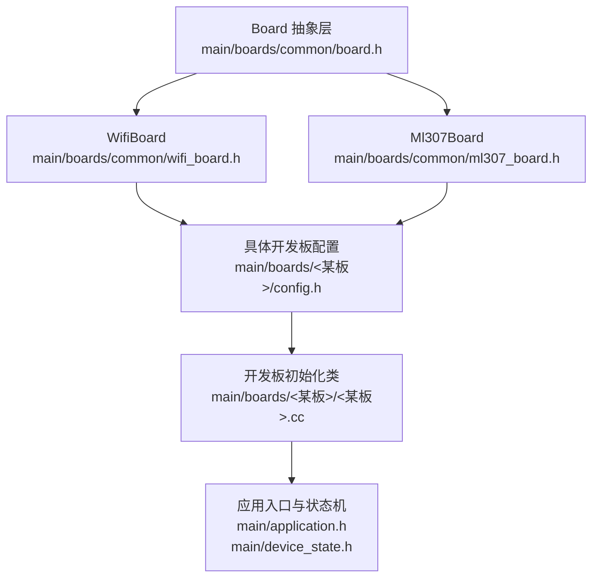
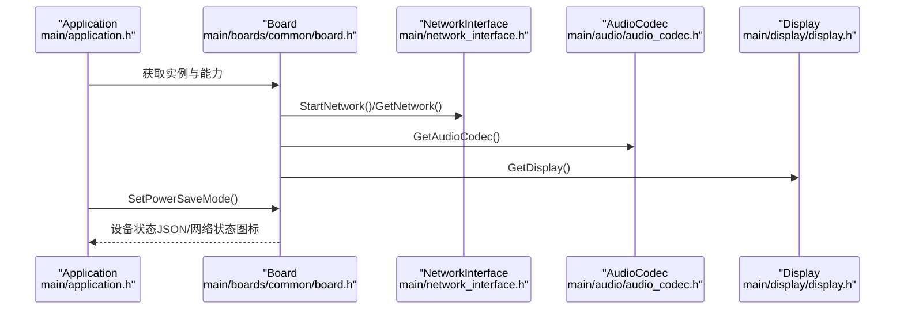
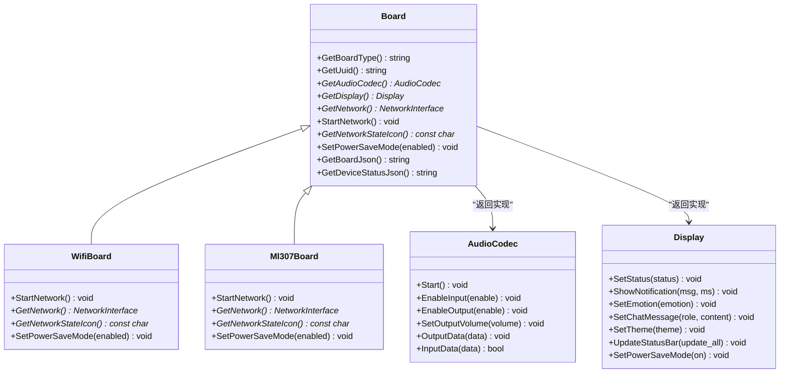
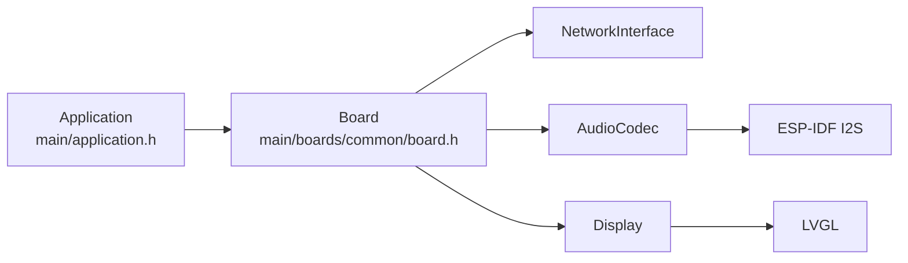

# 支持的硬件平台

<cite>
**本文引用的文件**
- [main/boards/README.md](file://main/boards/README.md)
- [main/boards/common/board.h](file://main/boards/common/board.h)
- [main/boards/common/wifi_board.h](file://main/boards/common/wifi_board.h)
- [main/boards/common/ml307_board.h](file://main/boards/common/ml307_board.h)
- [main/audio/audio_codec.h](file://main/audio/audio_codec.h)
- [main/display/display.h](file://main/display/display.h)
- [main/application.h](file://main/application.h)
- [main/device_state.h](file://main/device_state.h)
- [main/boards/esp-box-3/config.h](file://main/boards/esp-box-3/config.h)
- [main/boards/magiclick-2p4/config.h](file://main/boards/magiclick-2p4/config.h)
- [main/boards/xmini-c3/config.h](file://main/boards/xmini-c3/config.h)
- [main/boards/waveshare-p4-wifi6-touch-lcd-4b/config.h](file://main/boards/waveshare-p4-wifi6-touch-lcd-4b/config.h)
</cite>

## 目录
1. [简介](#简介)
2. [项目结构](#项目结构)
3. [核心组件](#核心组件)
4. [架构总览](#架构总览)
5. [详细组件分析](#详细组件分析)
6. [依赖分析](#依赖分析)
7. [性能考虑](#性能考虑)
8. [故障排除指南](#故障排除指南)
9. [结论](#结论)
10. [附录](#附录)

## 简介
本文件面向小智ESP32智能语音助手项目的硬件平台支持，系统化梳理项目对70+种ESP32系列开发板的支持方式与适配机制。内容涵盖：
- 各开发板的硬件配置要点（音频编解码、显示、按键、背光等）
- 硬件抽象层（HAL）设计与统一接口
- 硬件配置矩阵（示例维度：音频编解码器、显示驱动、网络接口）
- 开发者选型与移植建议
- 硬件兼容性检查与常见问题排查

## 项目结构
项目采用“按板级独立目录”的组织方式，每个开发板在 main/boards/<开发板名>/ 下维护独立的配置与初始化代码，并通过统一的Board抽象类对外暴露能力。

图表来源
- [main/boards/common/board.h](file://main/boards/common/board.h#L18-L53)
- [main/boards/common/wifi_board.h](file://main/boards/common/wifi_board.h#L6-L22)
- [main/boards/common/ml307_board.h](file://main/boards/common/ml307_board.h#L9-L27)

章节来源
- [main/boards/README.md](file://main/boards/README.md#L1-L335)
- [main/boards/common/board.h](file://main/boards/common/board.h#L1-L61)

## 核心组件
- Board 抽象基类：定义统一的硬件能力接口（音频编解码、显示、网络、背光、LED、相机、温度、电池等），并通过工厂函数 create_board() 实例化具体开发板。
- WifiBoard/Ml307Board/DualNetworkBoard：在Board基础上扩展网络能力（Wi-Fi、4G模块），并提供网络启动、状态图标、省电模式等通用行为。
- AudioCodec：抽象音频编解码器接口，屏蔽不同编解码芯片与I2S配置差异。
- Display：抽象显示接口，统一LVGL渲染、主题、通知、状态栏等UI能力。
- Application/DeviceState：应用主循环与设备状态机，协调各硬件模块运行。

章节来源
- [main/boards/common/board.h](file://main/boards/common/board.h#L18-L53)
- [main/boards/common/wifi_board.h](file://main/boards/common/wifi_board.h#L6-L22)
- [main/boards/common/ml307_board.h](file://main/boards/common/ml307_board.h#L9-L27)
- [main/audio/audio_codec.h](file://main/audio/audio_codec.h#L18-L57)
- [main/display/display.h](file://main/display/display.h#L18-L66)
- [main/application.h](file://main/application.h#L32-L87)
- [main/device_state.h](file://main/device_state.h#L4-L16)

## 架构总览
下图展示了从应用到硬件的调用链路与抽象层关系：

图表来源
- [main/application.h](file://main/application.h#L42-L58)
- [main/boards/common/board.h](file://main/boards/common/board.h#L36-L52)
- [main/audio/audio_codec.h](file://main/audio/audio_codec.h#L18-L57)
- [main/display/display.h](file://main/display/display.h#L18-L66)

## 详细组件分析

### 硬件抽象层（HAL）设计
- 统一接口：Board 抽象类定义 GetAudioCodec、GetDisplay、GetNetwork、GetBacklight 等纯虚函数，确保不同开发板以一致方式接入应用。
- 工厂模式：通过 DECLARE_BOARD 宏注册具体开发板类，Board::GetInstance() 内部调用 create_board() 返回对应实例。
- 网络抽象：WifiBoard/Ml307Board 提供 StartNetwork、GetNetwork、GetNetworkStateIcon、SetPowerSaveMode 等网络生命周期方法。
- 音频抽象：AudioCodec 定义输入/输出启停、音量、采样率、声道数等通用能力，具体芯片由各开发板 cc 文件注入。
- 显示抽象：Display 定义 UI 渲染、主题、通知、省电等接口，具体驱动由各开发板 cc 文件注入。

图表来源
- [main/boards/common/board.h](file://main/boards/common/board.h#L18-L53)
- [main/boards/common/wifi_board.h](file://main/boards/common/wifi_board.h#L6-L22)
- [main/boards/common/ml307_board.h](file://main/boards/common/ml307_board.h#L9-L27)
- [main/audio/audio_codec.h](file://main/audio/audio_codec.h#L18-L57)
- [main/display/display.h](file://main/display/display.h#L18-L66)

章节来源
- [main/boards/common/board.h](file://main/boards/common/board.h#L18-L53)
- [main/boards/common/wifi_board.h](file://main/boards/common/wifi_board.h#L6-L22)
- [main/boards/common/ml307_board.h](file://main/boards/common/ml307_board.h#L9-L27)
- [main/audio/audio_codec.h](file://main/audio/audio_codec.h#L18-L57)
- [main/display/display.h](file://main/display/display.h#L18-L66)

### 开发板配置与引脚定义（示例）
以下示例展示了典型开发板的配置要点（音频I2S、编解码器I2C、按键、显示等）。实际开发时，请以对应开发板目录下的 config.h 为准。

- ESP-BOX-3（ESP32-S3）
  - 音频：I2S引脚、编解码器I2C地址（含ES8311/ES7210）
  - 显示：分辨率、镜像/旋转参数
  - 背光：GPIO与极性
  - 按键：Boot按键
  - 参考路径：[main/boards/esp-box-3/config.h](file://main/boards/esp-box-3/config.h#L6-L41)

- Magiclick 2.4（ESP32-S3）
  - 音频：I2S引脚、编解码器I2C地址（ES8311）
  - LED：电源LED与指示LED
  - 按键：主键/左右键
  - 显示：I2C/SPI引脚、分辨率、镜像/旋转
  - 背光：GPIO与极性
  - 参考路径：[main/boards/magiclick-2p4/config.h](file://main/boards/magiclick-2p4/config.h#L6-L50)

- Xmini C3（ESP32-C3）
  - 音频：I2S引脚、编解码器I2C地址（ES8311）
  - 显示：分辨率、镜像/旋转
  - 按键：Boot按键
  - 参考路径：[main/boards/xmini-c3/config.h](file://main/boards/xmini-c3/config.h#L6-L28)

- Waveshare P4 WiFi6 触摸LCD（ESP32-P4）
  - 音频：I2S引脚、编解码器I2C地址（含ES8311/ES7210）
  - 显示：MIPI DSI 2通道、分辨率、背光
  - 按键：Boot按键
  - 参考路径：[main/boards/waveshare-p4-wifi6-touch-lcd-4b/config.h](file://main/boards/waveshare-p4-wifi6-touch-lcd-4b/config.h#L6-L47)

章节来源
- [main/boards/esp-box-3/config.h](file://main/boards/esp-box-3/config.h#L6-L41)
- [main/boards/magiclick-2p4/config.h](file://main/boards/magiclick-2p4/config.h#L6-L50)
- [main/boards/xmini-c3/config.h](file://main/boards/xmini-c3/config.h#L6-L28)
- [main/boards/waveshare-p4-wifi6-touch-lcd-4b/config.h](file://main/boards/waveshare-p4-wifi6-touch-lcd-4b/config.h#L6-L47)

### 硬件配置矩阵（示例维度）
以下为基于仓库中若干开发板的配置矩阵示例（字段来源于各开发板 config.h）。该表仅用于演示，实际字段与取值请以对应开发板配置为准。

- 音频编解码器支持
  - ES8311：广泛支持
  - ES7210：部分开发板支持（如ESP-BOX-3、Waveshare P4）
  - 其他：需查看对应开发板配置

- 显示驱动支持
  - SPI/I2C SSD1306/OLED：部分开发板支持
  - MIPI DSI（如Waveshare P4）：支持高分辨率触摸屏
  - 分辨率范围：从64×128 到 720×720 不等

- 网络接口支持
  - Wi-Fi：多数开发板通过 WifiBoard 支持
  - 4G模块（ML307）：部分开发板通过 Ml307Board 支持

- 特殊功能
  - 按键：多数开发板提供Boot键或组合键
  - 背光：多数开发板提供GPIO背光控制
  - 电池/温度：Board 接口提供可选能力

章节来源
- [main/boards/esp-box-3/config.h](file://main/boards/esp-box-3/config.h#L6-L41)
- [main/boards/magiclick-2p4/config.h](file://main/boards/magiclick-2p4/config.h#L6-L50)
- [main/boards/xmini-c3/config.h](file://main/boards/xmini-c3/config.h#L6-L28)
- [main/boards/waveshare-p4-wifi6-touch-lcd-4b/config.h](file://main/boards/waveshare-p4-wifi6-touch-lcd-4b/config.h#L6-L47)

### 开发者选型与移植建议
- 选型原则
  - 音频需求：优先选择已支持ES8311/ES7210的开发板；若无内置编解码器，需评估外接方案与I2S引脚占用。
  - 显示需求：根据分辨率与接口（SPI/I2C/DSI）选择；DSI方案适合高分辨率触摸屏。
  - 网络需求：需要4G场景选择Ml307Board；否则使用WifiBoard。
  - 引脚资源：核对I2S、I2C、SPI、按键、背光等引脚是否冲突。

- 移植步骤
  - 在 main/boards/ 下创建新目录，复制参考开发板的 config.h 与 config.json，调整引脚与参数。
  - 实现 <开发板>.cc，重写 GetAudioCodec/GetDisplay/GetBacklight 等虚函数，完成I2C/SPI/显示初始化。
  - 使用 DECLARE_BOARD 注册开发板。
  - 通过 scripts/release.py 指定开发板目录进行编译打包。

章节来源
- [main/boards/README.md](file://main/boards/README.md#L1-L335)
- [main/boards/common/board.h](file://main/boards/common/board.h#L55-L58)

## 依赖分析
- 组件耦合
  - Application 依赖 Board 能力（网络、音频、显示），通过 Board 的统一接口屏蔽具体硬件差异。
  - Board 依赖具体驱动（音频编解码、显示驱动、网络栈），但向上暴露统一接口。
- 外部依赖
  - ESP-IDF 驱动（I2S、I2C、SPI、触摸、显示面板等）
  - LVGL 图形库
  - 网络协议栈（MQTT/WebSocket/UDP）

图表来源
- [main/application.h](file://main/application.h#L69-L76)
- [main/boards/common/board.h](file://main/boards/common/board.h#L39-L44)
- [main/audio/audio_codec.h](file://main/audio/audio_codec.h#L4-L6)
- [main/display/display.h](file://main/display/display.h#L4-L7)

## 性能考虑
- 音频处理
  - 合理设置采样率与声道数，避免过高的DMA帧数导致CPU压力。
  - 使用I2S DMA通道与合适的描述符数量，平衡延迟与稳定性。
- 显示渲染
  - 控制刷新频率与区域更新，减少不必要的全屏刷新。
  - 在高分辨率DSI屏上启用适当的PM锁，避免在渲染期间进入深度睡眠。
- 网络与任务调度
  - 将网络与音频处理置于独立任务，避免阻塞UI渲染。
  - 合理设置事件组与定时器，降低唤醒频率。

## 故障排除指南
- 显示屏异常
  - 检查SPI/I2C引脚配置、时钟频率、命令/参数位宽。
  - 核对镜像/旋转/偏移参数，确认与硬件贴纸标注一致。
- 音频无声/杂音
  - 核对I2S MCLK/WS/BCLK/DIN/DOUT引脚与编解码器地址。
  - 检查PA功放使能引脚与音量设置。
- 无法联网
  - 确认Wi-Fi凭据与网络配置；必要时进入配置模式重置。
  - 检查4G模块串口引脚与DTR配置（如适用）。
- OTA升级回退
  - 自定义开发板需使用独立构建名与sdkconfig宏，避免OTA覆盖标准固件。

章节来源
- [main/boards/README.md](file://main/boards/README.md#L324-L329)

## 结论
小智ESP32项目通过Board抽象层与统一接口，实现了对70+种开发板的高效适配。开发者只需在各自开发板目录下完成引脚与配置映射，并实现必要的初始化逻辑，即可快速接入应用框架。建议在选型阶段充分评估音频、显示与网络需求，并遵循移植流程与命名规范，确保OTA升级与后续维护的稳定性。

## 附录
- 快速定位参考
  - 开发板定制指南：[main/boards/README.md](file://main/boards/README.md#L1-L335)
  - HAL基类与工厂注册：[main/boards/common/board.h](file://main/boards/common/board.h#L18-L58)
  - Wi-Fi网络板：[main/boards/common/wifi_board.h](file://main/boards/common/wifi_board.h#L6-L22)
  - 4G网络板：[main/boards/common/ml307_board.h](file://main/boards/common/ml307_board.h#L9-L27)
  - 音频编解码器接口：[main/audio/audio_codec.h](file://main/audio/audio_codec.h#L18-L57)
  - 显示接口：[main/display/display.h](file://main/display/display.h#L18-L66)
  - 应用与状态机：[main/application.h](file://main/application.h#L32-L87)，[main/device_state.h](file://main/device_state.h#L4-L16)