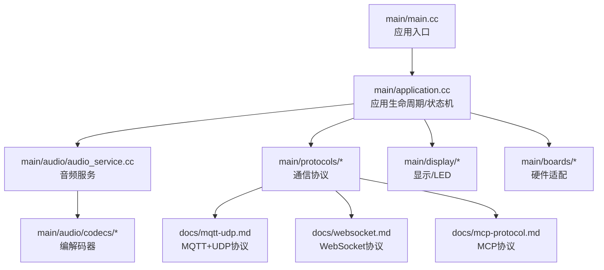
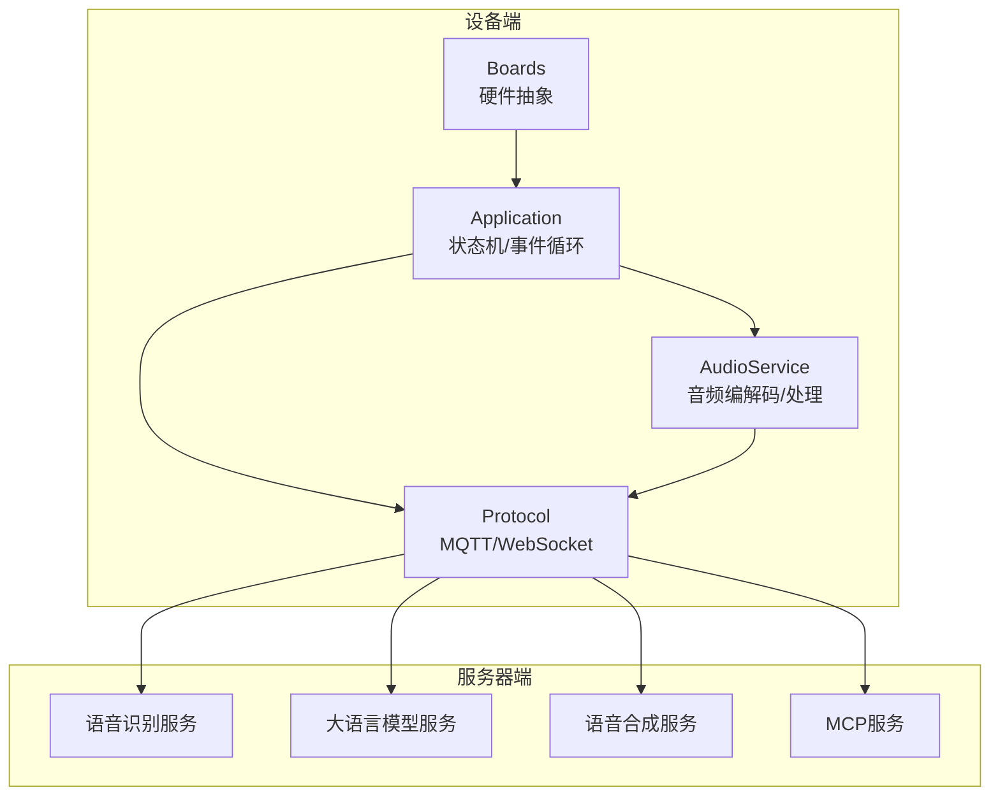
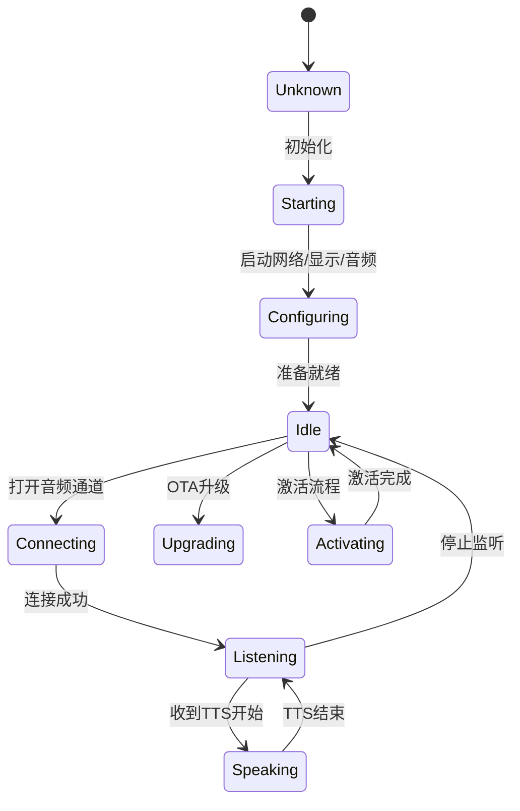
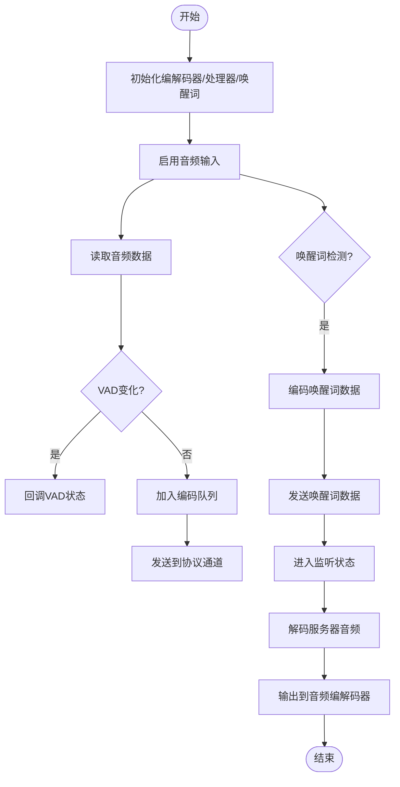
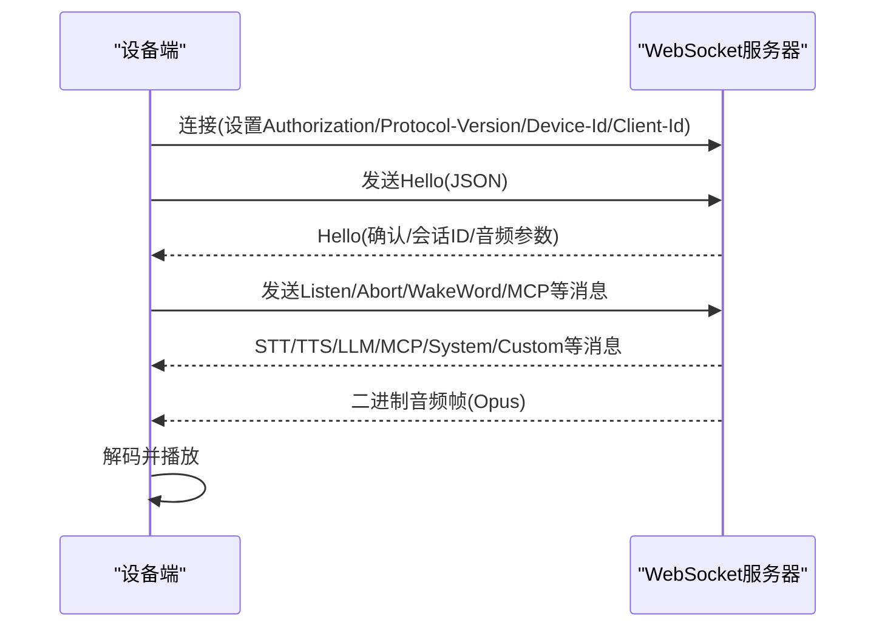
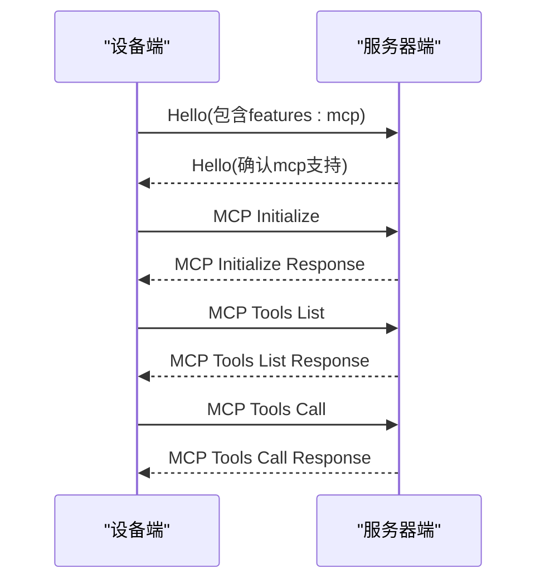
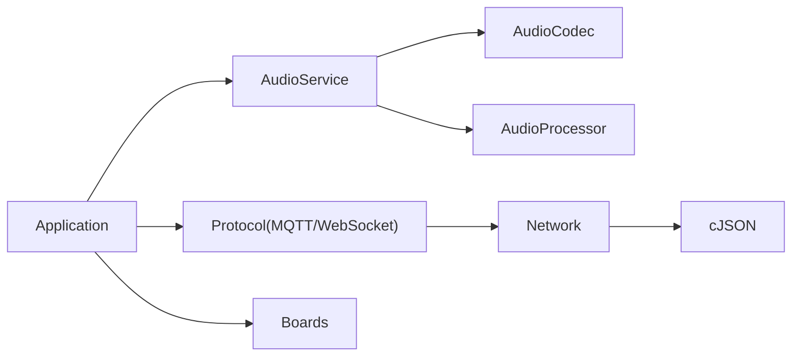

# 项目介绍

<cite>
**本文引用的文件**
- [README.md](file://README.md)
- [arch.md](file://arch.md)
- [main/main.cc](file://main/main.cc)
- [main/application.cc](file://main/application.cc)
- [main/audio/audio_service.cc](file://main/audio/audio_service.cc)
- [main/audio/codecs/es8311_audio_codec.cc](file://main/audio/codecs/es8311_audio_codec.cc)
- [main/protocols/mqtt_protocol.cc](file://main/protocols/mqtt_protocol.cc)
- [main/protocols/websocket_protocol.cc](file://main/protocols/websocket_protocol.cc)
- [docs/mqtt-udp.md](file://docs/mqtt-udp.md)
- [docs/websocket.md](file://docs/websocket.md)
- [docs/mcp-protocol.md](file://docs/mcp-protocol.md)
- [main/boards/README.md](file://main/boards/README.md)
</cite>

## 目录
1. [简介](#简介)
2. [项目结构](#项目结构)
3. [核心组件](#核心组件)
4. [架构总览](#架构总览)
5. [详细组件分析](#详细组件分析)
6. [依赖关系分析](#依赖关系分析)
7. [性能考量](#性能考量)
8. [故障排查指南](#故障排查指南)
9. [结论](#结论)
10. [附录](#附录)

## 简介
小智ESP32智能语音助手是一个基于ESP32系列芯片的嵌入式AI语音交互系统，提供从语音识别、语音合成到自然语言处理的完整闭环体验。项目支持多种通信协议（WebSocket、MQTT+UDP）与物联网控制协议（MCP），可广泛应用于智能家居控制、机器人语音交互、教育辅助等场景。项目强调多协议通信、多硬件平台适配、实时音频处理与低功耗运行，帮助开发者快速构建稳定、可扩展的AI语音终端。

## 项目结构
项目采用模块化分层设计，核心目录与职责如下：
- main：应用入口与核心业务逻辑，包含应用生命周期管理、音频服务、协议适配、显示与LED控制、OTA升级、设备状态机等。
- main/audio：音频编解码、音频处理器、唤醒词检测、音频队列与编解码任务等。
- main/protocols：MQTT+UDP与WebSocket协议实现，负责与云端或本地服务器的通信。
- main/boards：多款开发板的适配层，统一抽象硬件差异，便于跨平台移植。
- docs：协议与架构文档，涵盖MQTT+UDP、WebSocket、MCP协议的交互流程与设计要点。
- managed_components：ESP-IDF组件库，包含音频、显示、网络、传感器等第三方组件。

图表来源
- [main/main.cc](file://main/main.cc#L1-L32)
- [main/application.cc](file://main/application.cc#L1-L120)
- [main/audio/audio_service.cc](file://main/audio/audio_service.cc#L1-L120)
- [main/protocols/mqtt_protocol.cc](file://main/protocols/mqtt_protocol.cc#L1-L60)
- [main/protocols/websocket_protocol.cc](file://main/protocols/websocket_protocol.cc#L1-L60)
- [docs/mqtt-udp.md](file://docs/mqtt-udp.md#L1-L60)
- [docs/websocket.md](file://docs/websocket.md#L1-L60)
- [docs/mcp-protocol.md](file://docs/mcp-protocol.md#L1-L40)

章节来源
- [main/main.cc](file://main/main.cc#L1-L32)
- [main/application.cc](file://main/application.cc#L1-L120)
- [arch.md](file://arch.md#L1-L110)

## 核心组件
- 应用入口与生命周期管理：负责事件循环、设备状态机、OTA升级、协议选择与初始化。
- 音频服务：负责音频输入/输出、编解码（Opus）、音频处理器（AEC/VAD/降噪）、唤醒词检测、音频队列与任务调度。
- 通信协议：支持WebSocket与MQTT+UDP两种模式，分别用于全双工消息与分离式控制/数据通道。
- 硬件适配：统一抽象开发板差异，支持70+种ESP32系列开发板，便于快速移植与扩展。
- MCP协议：基于JSON-RPC 2.0，用于设备能力发现与物联网控制，替代传统“iot”方案。

章节来源
- [main/application.cc](file://main/application.cc#L328-L512)
- [main/audio/audio_service.cc](file://main/audio/audio_service.cc#L32-L137)
- [main/protocols/mqtt_protocol.cc](file://main/protocols/mqtt_protocol.cc#L44-L137)
- [main/protocols/websocket_protocol.cc](file://main/protocols/websocket_protocol.cc#L23-L76)
- [main/boards/README.md](file://main/boards/README.md#L1-L40)

## 架构总览
系统采用“设备端+服务器”的分布式架构，设备端通过协议通道与服务器交互，完成语音识别、语音合成与自然语言处理，并通过MCP协议实现对周边设备的控制。

图表来源
- [arch.md](file://arch.md#L9-L17)
- [main/application.cc](file://main/application.cc#L368-L398)
- [docs/mqtt-udp.md](file://docs/mqtt-udp.md#L24-L57)
- [docs/websocket.md](file://docs/websocket.md#L7-L80)

章节来源
- [arch.md](file://arch.md#L1-L110)
- [docs/mqtt-udp.md](file://docs/mqtt-udp.md#L1-L120)
- [docs/websocket.md](file://docs/websocket.md#L1-L120)

## 详细组件分析

### 应用生命周期与状态机
- 初始化：创建事件循环、初始化NVS、启动Application。
- 启动流程：初始化显示、音频编解码、网络、协议（MQTT或WebSocket），加载OTA配置，进入空闲状态。
- 事件循环：基于事件组驱动音频发送、唤醒词检测、VAD变化、错误处理与异步任务调度。
- 状态机：包含starting、configuring、idle、connecting、listening、speaking、upgrading、activating、audio_testing、fatal_error等状态，支持AEC模式切换与睡眠模式判断。

图表来源
- [main/application.cc](file://main/application.cc#L21-L34)
- [main/application.cc](file://main/application.cc#L634-L694)
- [docs/websocket.md](file://docs/websocket.md#L328-L365)

章节来源
- [main/main.cc](file://main/main.cc#L13-L31)
- [main/application.cc](file://main/application.cc#L328-L512)

### 音频服务与实时处理
- 音频编解码：使用Opus编解码器，支持16kHz采样率、单声道、60ms帧时长；根据设备/服务器采样率进行重采样。
- 音频处理器：支持AEC（设备侧/服务器侧）、VAD、降噪等；可按需启用/禁用。
- 唤醒词检测：支持ESP-SR、AFE、自定义唤醒词，检测到后编码并发送唤醒词数据。
- 队列与任务：音频输入/输出/编解码三类任务队列，采用事件组与互斥锁协调，保障实时性与稳定性。

图表来源
- [main/audio/audio_service.cc](file://main/audio/audio_service.cc#L32-L93)
- [main/audio/audio_service.cc](file://main/audio/audio_service.cc#L209-L276)
- [main/audio/audio_service.cc](file://main/audio/audio_service.cc#L314-L391)

章节来源
- [main/audio/audio_service.cc](file://main/audio/audio_service.cc#L32-L137)
- [main/audio/codecs/es8311_audio_codec.cc](file://main/audio/codecs/es8311_audio_codec.cc#L66-L94)

### 通信协议：WebSocket与MQTT+UDP
- WebSocket协议：全双工通信，支持二进制帧（Opus音频）与文本帧（JSON消息）。握手后发送hello，等待服务器确认；支持MCP封装；断线回调触发通道关闭。
- MQTT+UDP协议：控制与数据分离，MQTT用于控制消息与会话管理，UDP用于实时音频数据（AES-CTR加密）。设备通过hello消息协商UDP服务器、密钥与随机数，建立音频通道。

图表来源
- [docs/websocket.md](file://docs/websocket.md#L16-L78)
- [docs/websocket.md](file://docs/websocket.md#L128-L292)
- [main/protocols/websocket_protocol.cc](file://main/protocols/websocket_protocol.cc#L23-L200)

章节来源
- [docs/websocket.md](file://docs/websocket.md#L1-L200)
- [main/protocols/websocket_protocol.cc](file://main/protocols/websocket_protocol.cc#L23-L200)
- [docs/mqtt-udp.md](file://docs/mqtt-udp.md#L22-L57)
- [main/protocols/mqtt_protocol.cc](file://main/protocols/mqtt_protocol.cc#L44-L137)

### MCP协议：设备能力发现与物联网控制
- 基于JSON-RPC 2.0，通过type:"mcp"承载payload，实现initialize、tools/list、tools/call等方法。
- 设备端支持工具动态注册与调用，配合服务器端实现对周边设备的控制与状态同步。
- 与WebSocket/MQTT协议组合使用，统一承载MCP消息。

图表来源
- [docs/mcp-protocol.md](file://docs/mcp-protocol.md#L219-L267)
- [main/application.cc](file://main/application.cc#L408-L496)

章节来源
- [docs/mcp-protocol.md](file://docs/mcp-protocol.md#L1-L120)
- [main/application.cc](file://main/application.cc#L408-L496)

### 硬件适配与多平台支持
- 项目支持70+种ESP32系列开发板，通过boards目录下的具体板级实现，统一抽象I2C、SPI、显示、按钮、音频编解码等硬件差异。
- 开发板定制流程：创建目录、编写config.h/config.json、实现板级初始化类、注册开发板、生成固件。

章节来源
- [main/boards/README.md](file://main/boards/README.md#L1-L120)
- [main/boards/README.md](file://main/boards/README.md#L272-L335)

## 依赖关系分析
- 应用层依赖音频服务与协议层；音频服务依赖编解码器与音频处理器；协议层依赖网络组件与JSON解析库。
- 硬件层通过boards抽象屏蔽差异，使应用层无需关心具体芯片与外设。
- 组件间耦合度低，通过事件回调与消息封装实现松耦合。

图表来源
- [main/application.cc](file://main/application.cc#L1-L20)
- [main/audio/audio_service.cc](file://main/audio/audio_service.cc#L1-L20)
- [main/protocols/mqtt_protocol.cc](file://main/protocols/mqtt_protocol.cc#L1-L12)
- [main/protocols/websocket_protocol.cc](file://main/protocols/websocket_protocol.cc#L1-L12)
- [main/boards/README.md](file://main/boards/README.md#L1-L20)

章节来源
- [main/application.cc](file://main/application.cc#L1-L20)
- [main/audio/audio_service.cc](file://main/audio/audio_service.cc#L1-L20)
- [main/protocols/mqtt_protocol.cc](file://main/protocols/mqtt_protocol.cc#L1-L12)
- [main/protocols/websocket_protocol.cc](file://main/protocols/websocket_protocol.cc#L1-L12)

## 性能考量
- 实时性：音频编解码与播放采用独立任务与队列，结合事件组与互斥锁，降低抖动与阻塞。
- 低功耗：空闲状态下可进入睡眠模式，音频通道关闭时自动降低功耗。
- 网络优化：MQTT+UDP分离通道，控制消息走MQTT，音频数据走UDP，减少拥塞与延迟。
- 加密与安全：UDP通道采用AES-CTR加密，序列号管理防止重放与乱序。
- 资源管理：动态创建/销毁网络对象，及时释放内存与句柄，避免泄漏。

章节来源
- [main/application.cc](file://main/application.cc#L722-L737)
- [docs/mqtt-udp.md](file://docs/mqtt-udp.md#L323-L343)
- [docs/mqtt-udp.md](file://docs/mqtt-udp.md#L303-L320)

## 故障排查指南
- 无法连接服务器
  - 检查MQTT端点、用户名/密码、KeepAlive配置；确认网络连通性与DNS解析。
  - 查看错误回调与日志，关注“服务器未找到/未连接/超时”等提示。
- 音频无声或失真
  - 检查编解码器初始化、I2S配置、PA使能引脚；确认采样率与声道数匹配。
  - 关注音频功率定时器与输入/输出启用状态。
- 唤醒词不生效
  - 确认唤醒词检测模块初始化与启用；检查音频输入质量与噪声抑制。
- MCP调用失败
  - 确认服务器端MCP服务已初始化且工具列表可用；检查方法名与参数schema。
- OTA升级失败
  - 检查升级URL、版本校验与重试策略；确认升级过程中的音频服务暂停与重启逻辑。

章节来源
- [main/protocols/mqtt_protocol.cc](file://main/protocols/mqtt_protocol.cc#L62-L68)
- [main/audio/audio_service.cc](file://main/audio/audio_service.cc#L154-L207)
- [docs/mcp-protocol.md](file://docs/mcp-protocol.md#L120-L195)
- [main/application.cc](file://main/application.cc#L70-L176)

## 结论
小智ESP32智能语音助手项目以模块化架构与多协议通信为核心，结合丰富的硬件适配与MCP协议，提供了从语音识别到设备控制的完整解决方案。其在实时性、安全性与可扩展性方面均有良好设计，适合在智能家居、机器人、教育等领域快速落地与二次开发。

## 附录
- 主要应用场景
  - 智能家居控制：通过MCP协议控制灯光、窗帘、空调等设备。
  - 机器人语音交互：结合唤醒词与自然语言处理，实现人机对话。
  - 教育辅助：语音问答、发音评测与互动教学。
- 技术特色
  - 多协议通信：WebSocket与MQTT+UDP互补，兼顾实时性与可靠性。
  - 多硬件平台适配：70+开发板支持，快速移植与扩展。
  - 实时音频处理：Opus编解码、AEC/VAD、唤醒词检测与低功耗管理。
- 初学者建议
  - 从最小可行设备入手，先跑通WebSocket或MQTT+UDP的hello流程。
  - 熟悉音频服务的输入/输出与编解码链路，逐步接入唤醒词与MCP。
  - 参考boards目录下的开发板实现，理解硬件抽象与配置方法。