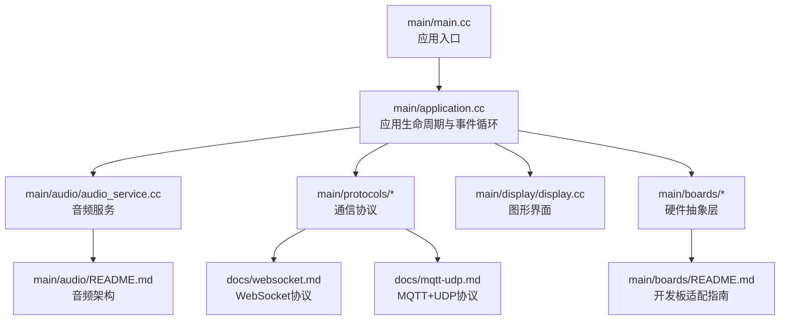
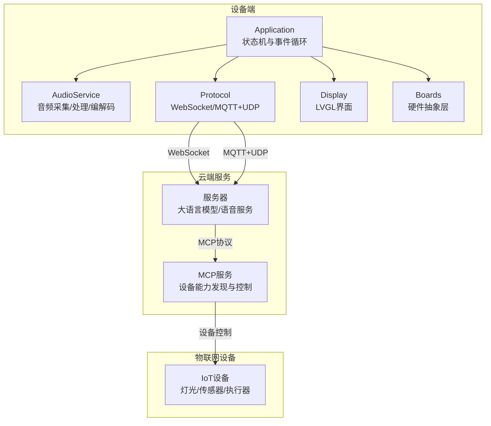
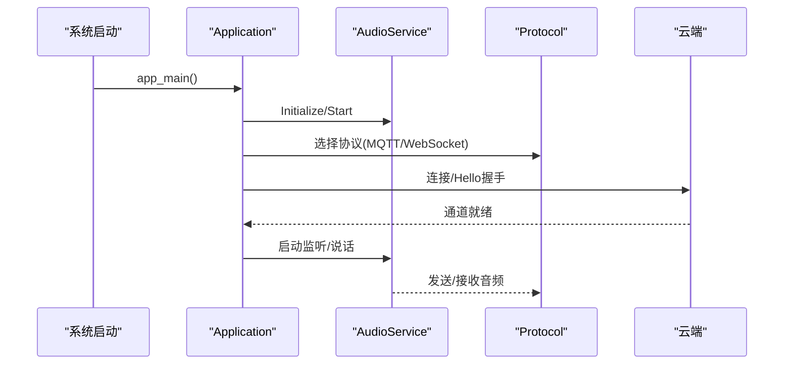
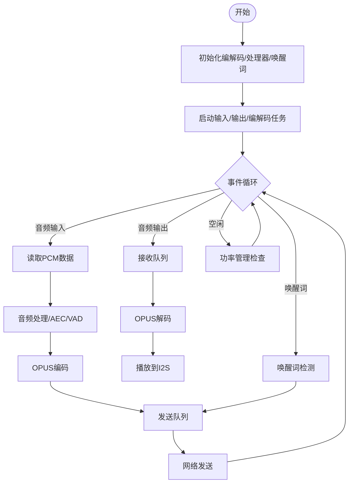
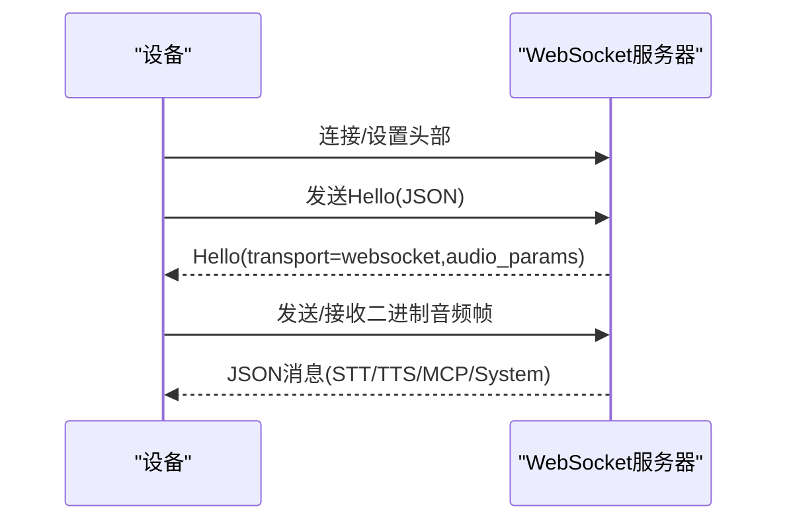
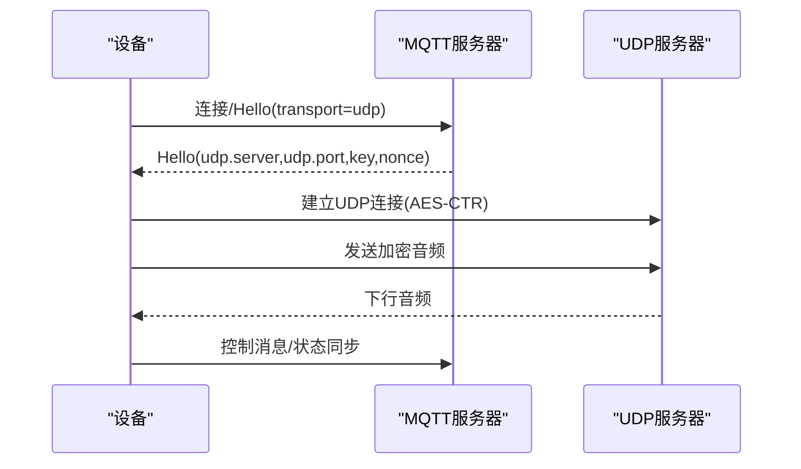
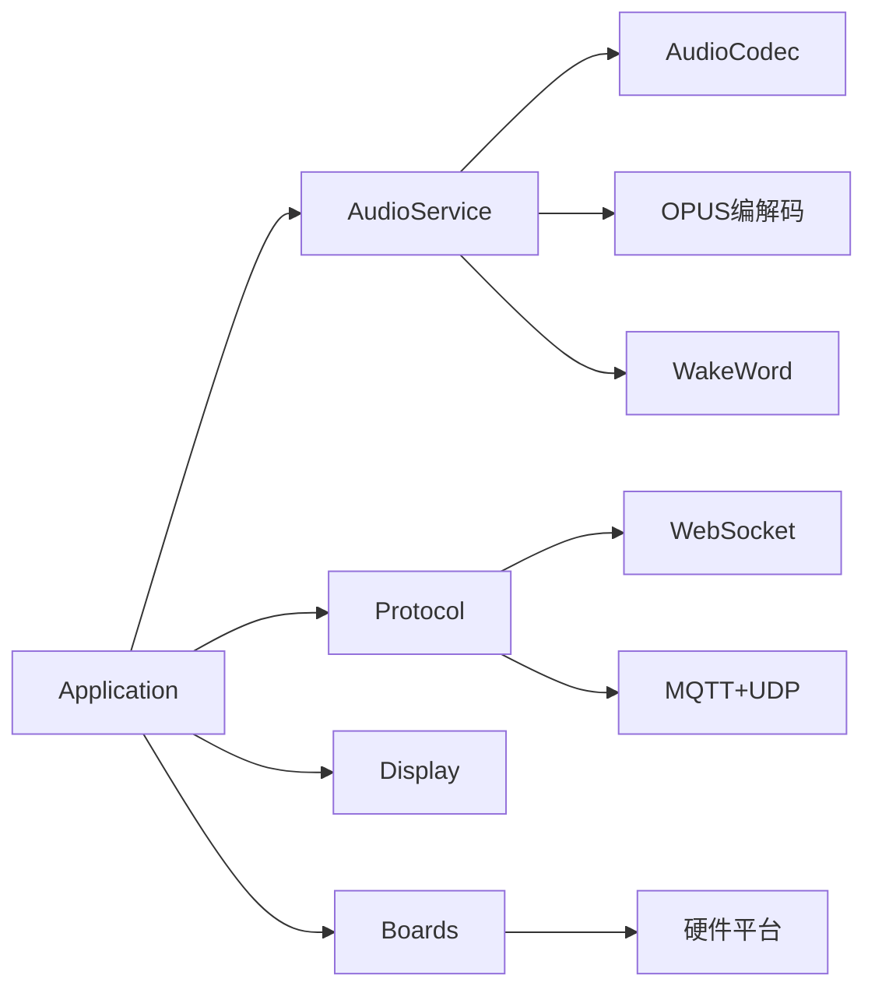

# 项目概述

<cite>
**本文引用的文件**
- [main/main.cc](file://main/main.cc)
- [main/application.cc](file://main/application.cc)
- [main/audio/audio_service.cc](file://main/audio/audio_service.cc)
- [main/audio/README.md](file://main/audio/README.md)
- [main/boards/README.md](file://main/boards/README.md)
- [main/protocols/mqtt_protocol.cc](file://main/protocols/mqtt_protocol.cc)
- [main/protocols/websocket_protocol.cc](file://main/protocols/websocket_protocol.cc)
- [main/display/display.cc](file://main/display/display.cc)
- [CMakeLists.txt](file://CMakeLists.txt)
- [arch.md](file://arch.md)
- [docs/mqtt-udp.md](file://docs/mqtt-udp.md)
- [docs/websocket.md](file://docs/websocket.md)
- [docs/mcp-protocol.md](file://docs/mcp-protocol.md)
</cite>

## 目录
1. [简介](#简介)
2. [项目结构](#项目结构)
3. [核心组件](#核心组件)
4. [架构总览](#架构总览)
5. [详细组件分析](#详细组件分析)
6. [依赖关系分析](#依赖关系分析)
7. [性能考量](#性能考量)
8. [故障排查指南](#故障排查指南)
9. [结论](#结论)
10. [附录](#附录)

## 简介
小智ESP32智能语音助手是一个面向嵌入式AI语音交互的开源项目，基于ESP32系列芯片构建，支持多种通信协议（WebSocket、MQTT+UDP）与物联网控制协议（MCP）。项目旨在将大语言模型（如Qwen、DeepSeek）的能力集成到硬件设备中，实现语音唤醒、语音识别（STT）、语音合成（TTS）、自然语言理解与设备控制等核心能力。

项目支持70+种开发板平台，覆盖主流厂商的ESP32-S3、ESP32-C3等开发板，提供统一的硬件抽象层与多协议通信能力，既适合初学者快速上手，也为有经验的开发者提供了可扩展的架构与丰富的技术深度。

## 项目结构
项目采用模块化与分层设计，核心目录与职责如下：
- main：应用入口、应用生命周期管理、音频服务、通信协议、显示与交互、OTA升级、系统信息等
- main/audio：音频采集、处理、编码/解码、唤醒词检测、音频任务队列与线程模型
- main/boards：70+种开发板的硬件适配层，统一的板级初始化与配置
- main/protocols：WebSocket与MQTT+UDP协议实现，负责与云端服务的双向通信
- main/display：基于LVGL的图形界面与状态栏显示
- docs：协议与架构文档
- managed_components：ESP-IDF组件管理的第三方库，如ESP-SR、ESP-Codec、LVGL等

图表来源
- [main/main.cc](file://main/main.cc#L1-L32)
- [main/application.cc](file://main/application.cc#L1-L120)
- [main/audio/audio_service.cc](file://main/audio/audio_service.cc#L1-L120)
- [main/boards/README.md](file://main/boards/README.md#L1-L60)
- [docs/websocket.md](file://docs/websocket.md#L1-L60)
- [docs/mqtt-udp.md](file://docs/mqtt-udp.md#L1-L60)

章节来源
- [main/main.cc](file://main/main.cc#L1-L32)
- [main/application.cc](file://main/application.cc#L328-L512)
- [main/audio/README.md](file://main/audio/README.md#L1-L88)
- [main/boards/README.md](file://main/boards/README.md#L1-L60)
- [CMakeLists.txt](file://CMakeLists.txt#L1-L15)

## 核心组件
- 应用层（Application）
  - 负责设备状态机管理、事件循环、OTA升级、协议选择与初始化、与音频服务与显示层的协调
  - 关键职责：状态切换、事件调度、协议通道管理、告警与提示
- 音频服务（AudioService）
  - 音频采集、处理、编码/解码、播放、唤醒词检测、音频任务队列与线程模型
  - 关键职责：I2S驱动、OPUS编解码、AEC/VAD、音频功率管理
- 通信协议（WebSocket/MQTT+UDP）
  - WebSocket协议：全双工通信，支持二进制音频帧与JSON消息
  - MQTT+UDP协议：控制与数据分离，UDP承载加密音频流
- 显示与交互（Display/LVGL）
  - 状态栏、表情、通知、电池与网络图标、聊天消息显示
- 硬件抽象层（Boards）
  - 70+种开发板的统一初始化与配置，涵盖音频编解码、显示、按键、电源管理等

章节来源
- [main/application.cc](file://main/application.cc#L328-L512)
- [main/audio/audio_service.cc](file://main/audio/audio_service.cc#L33-L137)
- [main/protocols/websocket_protocol.cc](file://main/protocols/websocket_protocol.cc#L23-L76)
- [main/protocols/mqtt_protocol.cc](file://main/protocols/mqtt_protocol.cc#L44-L137)
- [main/display/display.cc](file://main/display/display.cc#L64-L195)
- [main/boards/README.md](file://main/boards/README.md#L1-L60)

## 架构总览
系统采用“设备端-云端服务-物联网设备”的三层架构，支持多协议与多硬件平台：

图表来源
- [arch.md](file://arch.md#L1-L110)
- [docs/websocket.md](file://docs/websocket.md#L1-L120)
- [docs/mqtt-udp.md](file://docs/mqtt-udp.md#L1-L120)
- [docs/mcp-protocol.md](file://docs/mcp-protocol.md#L1-L60)

章节来源
- [arch.md](file://arch.md#L1-L110)

## 详细组件分析

### 应用层（Application）
- 职责
  - 初始化NVSD、事件循环、音频服务、显示与网络
  - 管理设备状态机（启动、配置、空闲、连接、监听、说话、升级、激活、音频测试、致命错误等）
  - 协调协议通道（WebSocket/MQTT+UDP）与音频服务
  - OTA升级与激活流程
- 关键流程
  - 启动流程：初始化硬件与服务 → 检查版本/激活 → 选择协议 → 启动事件循环
  - 事件循环：监听发送队列、唤醒词、VAD状态变更、调度任务
  - 语音交互：打开音频通道 → 发送/接收音频 → 状态切换（监听/说话）

图表来源
- [main/main.cc](file://main/main.cc#L13-L31)
- [main/application.cc](file://main/application.cc#L328-L512)
- [main/protocols/websocket_protocol.cc](file://main/protocols/websocket_protocol.cc#L82-L200)
- [main/protocols/mqtt_protocol.cc](file://main/protocols/mqtt_protocol.cc#L194-L274)

章节来源
- [main/main.cc](file://main/main.cc#L13-L31)
- [main/application.cc](file://main/application.cc#L328-L512)

### 音频服务（AudioService）
- 职责
  - 音频采集（I2S）、处理（AEC/VAD）、编码/解码（OPUS）、播放（I2S）
  - 唤醒词检测（ESP-SR/AFE/自定义）
  - 音频任务队列与线程模型（输入/输出/编解码）
  - 音频功率管理（空闲自动关闭输入/输出）
- 关键流程
  - 输入路径：麦克风PCM → 处理/唤醒词 → 编码 → 发送队列
  - 输出路径：接收队列 → 解码 → 播放
  - 功率管理：定时检查活动状态，自动启停输入/输出

图表来源
- [main/audio/audio_service.cc](file://main/audio/audio_service.cc#L33-L137)
- [main/audio/audio_service.cc](file://main/audio/audio_service.cc#L209-L391)
- [main/audio/README.md](file://main/audio/README.md#L22-L88)

章节来源
- [main/audio/audio_service.cc](file://main/audio/audio_service.cc#L33-L137)
- [main/audio/audio_service.cc](file://main/audio/audio_service.cc#L209-L391)
- [main/audio/README.md](file://main/audio/README.md#L1-L88)

### 通信协议（WebSocket/MQTT+UDP）
- WebSocket协议
  - 全双工通信，支持二进制音频帧与JSON消息
  - Hello握手、会话管理、音频参数协商、MCP封装
- MQTT+UDP协议
  - 控制通道（MQTT）与数据通道（UDP）分离
  - UDP承载加密音频流（AES-CTR），序列号保护，自动重连

图表来源
- [docs/websocket.md](file://docs/websocket.md#L1-L120)
- [main/protocols/websocket_protocol.cc](file://main/protocols/websocket_protocol.cc#L82-L200)

图表来源
- [docs/mqtt-udp.md](file://docs/mqtt-udp.md#L20-L120)
- [main/protocols/mqtt_protocol.cc](file://main/protocols/mqtt_protocol.cc#L194-L274)

章节来源
- [docs/websocket.md](file://docs/websocket.md#L1-L200)
- [docs/mqtt-udp.md](file://docs/mqtt-udp.md#L1-L200)
- [main/protocols/websocket_protocol.cc](file://main/protocols/websocket_protocol.cc#L23-L200)
- [main/protocols/mqtt_protocol.cc](file://main/protocols/mqtt_protocol.cc#L44-L274)

### 显示与交互（Display/LVGL）
- 职责
  - 状态栏显示（时间、网络、静音、电池）
  - 表情与通知显示
  - 聊天消息展示
  - 低电量弹窗与音效联动
- 关键点
  - 10秒周期刷新状态栏
  - 低电量时弹窗与声音提醒
  - 主题与设置持久化

章节来源
- [main/display/display.cc](file://main/display/display.cc#L64-L195)

### 硬件抽象层（Boards）
- 职责
  - 统一的开发板初始化与配置
  - 音频编解码、显示、按键、电源管理等硬件适配
  - 支持70+种开发板，覆盖ESP32-S3、ESP32-C3等
- 关键点
  - config.h定义硬件引脚与参数
  - config.json定义目标芯片与编译选项
  - 通过宏与模板实现差异化适配

章节来源
- [main/boards/README.md](file://main/boards/README.md#L1-L120)

## 依赖关系分析
- 组件耦合
  - Application依赖AudioService、Protocol、Display、Boards
  - AudioService依赖AudioCodec、WakeWord、Opus编解码器
  - Protocol依赖网络组件（WebSocket/MQTT/UDP）
- 外部依赖
  - ESP-IDF框架、LVGL图形界面、ESP-SR语音识别、ESP-Codec音频编解码等
- 通信协议
  - WebSocket与MQTT+UDP协议分别封装在独立模块中，通过统一接口与应用层交互

图表来源
- [main/application.cc](file://main/application.cc#L1-L120)
- [main/audio/audio_service.cc](file://main/audio/audio_service.cc#L1-L120)
- [main/protocols/websocket_protocol.cc](file://main/protocols/websocket_protocol.cc#L1-L40)
- [main/protocols/mqtt_protocol.cc](file://main/protocols/mqtt_protocol.cc#L1-L40)
- [main/boards/README.md](file://main/boards/README.md#L1-L60)

章节来源
- [main/application.cc](file://main/application.cc#L1-L120)
- [main/audio/audio_service.cc](file://main/audio/audio_service.cc#L1-L120)
- [main/protocols/websocket_protocol.cc](file://main/protocols/websocket_protocol.cc#L1-L40)
- [main/protocols/mqtt_protocol.cc](file://main/protocols/mqtt_protocol.cc#L1-L40)
- [main/boards/README.md](file://main/boards/README.md#L1-L60)

## 性能考量
- 实时性
  - 音频处理采用FreeRTOS任务与队列，避免阻塞
  - OPUS编解码与AES-CTR加密在专用任务中执行
- 功耗管理
  - 音频输入/输出通道空闲自动关闭，降低功耗
  - 低电量弹窗与静音状态提示减少不必要的显示刷新
- 网络优化
  - MQTT+UDP分离控制与数据，提升实时性
  - WebSocket支持二进制协议版本（含时间戳），便于服务器端AEC
- 可扩展性
  - 开发板适配层通过config.h/config.json实现灵活配置
  - MCP协议支持动态工具注册与调用，便于扩展设备控制能力

## 故障排查指南
- 启动与连接问题
  - NVS初始化失败：检查nvs_flash初始化与擦除逻辑
  - 协议连接失败：检查MQTT/WS配置、认证信息与网络连通性
- 音频问题
  - 无声/杂音：检查I2S引脚配置、编解码器地址、采样率与声道数
  - 唤醒词不灵敏：检查唤醒词模型与阈值配置
- 显示问题
  - 屏幕不显示：检查SPI/I2C引脚、面板驱动与LVGL初始化
- OTA与激活
  - 升级失败：检查升级URL、证书与网络状态
  - 激活超时：确认激活码与服务器响应

章节来源
- [main/main.cc](file://main/main.cc#L18-L25)
- [main/application.cc](file://main/application.cc#L70-L176)
- [main/audio/audio_service.cc](file://main/audio/audio_service.cc#L154-L207)
- [main/display/display.cc](file://main/display/display.cc#L132-L195)

## 结论
小智ESP32智能语音助手项目以模块化架构与多协议通信为核心，结合丰富的硬件适配与统一的开发板支持，为嵌入式AI语音交互提供了完整的解决方案。项目在实时性、功耗管理与可扩展性方面均有良好设计，既满足初学者的入门需求，也具备足够的技术深度供高级开发者深入定制与扩展。

## 附录
- 技术栈概览
  - 框架：ESP-IDF
  - 图形界面：LVGL
  - 语音识别：ESP-SR
  - 音频编解码：OPUS
  - 通信协议：WebSocket、MQTT+UDP
  - 组件管理：managed_components
- 版本信息
  - 项目版本：1.9.0（CMakeLists.txt）

章节来源
- [CMakeLists.txt](file://CMakeLists.txt#L7-L10)
- [arch.md](file://arch.md#L78-L83)