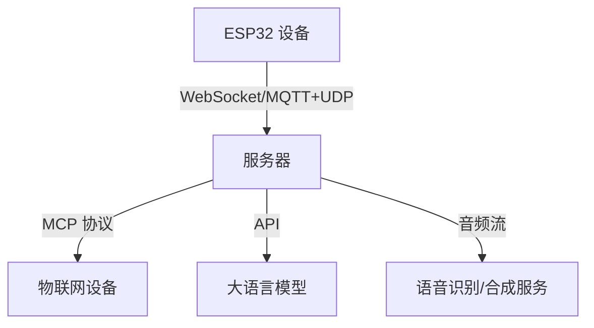

# 小智 ESP32-ZC307 架构文档

## 1. 项目概述

小智 ESP32-ZC307 是一个基于 ESP32 系列芯片的 AI 语音聊天机器人项目，支持多种通信协议（WebSocket、MQTT+UDP）和物联网控制协议（MCP）。项目的主要目标是将大语言模型（如 Qwen、DeepSeek）的能力集成到硬件设备中，实现语音交互和设备控制功能。

## 2. 系统架构

### 2.1 整体架构

### 2.2 核心模块

1. **音频处理模块**
   - 支持离线语音唤醒（ESP-SR）
   - 采用 OPUS 音频编解码
   - 支持声纹识别（3D Speaker）

2. **通信模块**
   - WebSocket 协议：用于全双工通信
   - MQTT+UDP 混合协议：控制与数据分离
   - MCP 协议：用于设备能力发现和控制

3. **显示与交互模块**
   - 支持 OLED/LCD 显示屏
   - 支持多语言（中文、英文、日文）
   - 支持表情显示

4. **电源管理模块**
   - 电量显示
   - 低功耗模式

## 3. 通信协议

### 3.1 WebSocket 协议

- **用途**：全双工通信，支持音频流和 JSON 消息
- **特点**：
  - 支持二进制和文本帧
  - 支持 MCP 协议封装
- **详细文档**：[websocket.md](./docs/websocket.md)

### 3.2 MQTT+UDP 混合协议

- **用途**：控制与数据分离
- **特点**：
  - MQTT 用于控制消息
  - UDP 用于音频数据传输（AES-CTR 加密）
- **详细文档**：[mqtt-udp.md](./docs/mqtt-udp.md)

### 3.3 MCP 协议

- **用途**：设备能力发现和控制
- **特点**：
  - 基于 JSON-RPC 2.0
  - 支持工具（Tool）的动态注册和调用
- **详细文档**：[mcp-protocol.md](./docs/mcp-protocol.md)

## 4. 硬件支持

项目支持 70 多种 ESP32 系列开发板，包括：

- 乐鑫 ESP32-S3-BOX3
- M5Stack CoreS3
- 立创·实战派 ESP32-S3 开发板
- 微雪电子 ESP32-S3-Touch-AMOLED
- LILYGO T-Circle-S3

详细列表见 [README.md](./README.md)。

## 5. 开发环境

- **IDE**：Cursor 或 VSCode
- **SDK**：ESP-IDF 5.4+
- **代码风格**：Google C++ 代码风格

## 6. 部署与扩展

### 6.1 固件烧录

- 支持免开发环境烧录
- 支持 OTA 升级

### 6.2 服务器部署

项目支持多种服务器实现：

- Python 服务器：[xiaozhi-esp32-server](https://github.com/xinnan-tech/xiaozhi-esp32-server)
- Java 服务器：[xiaozhi-esp32-server-java](https://github.com/joey-zhou/xiaozhi-esp32-server-java)
- Golang 服务器：[xiaozhi-server-go](https://github.com/AnimeAIChat/xiaozhi-server-go)

## 7. 后续计划

1. 支持更多大语言模型
2. 扩展 MCP 协议的功能
3. 优化低功耗模式
4. 增加更多硬件支持

## 8. 相关资源

- [项目 GitHub](https://github.com/78/xiaozhi-esp32)
- [飞书文档](https://ccnphfhqs21z.feishu.cn/wiki/F5krwD16viZoF0kKkvDcrZNYnhb)
- [Bilibili 视频](https://www.bilibili.com/video/BV1bpjgzKEhd/)